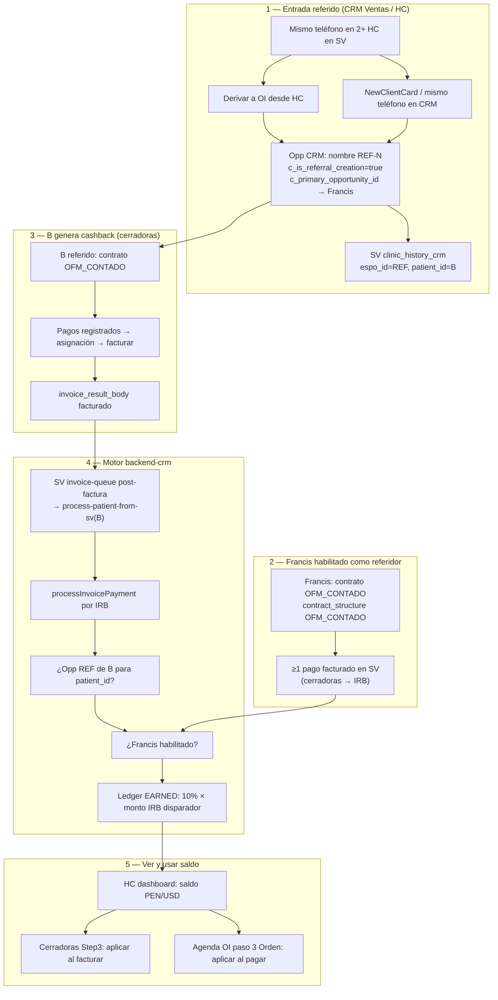
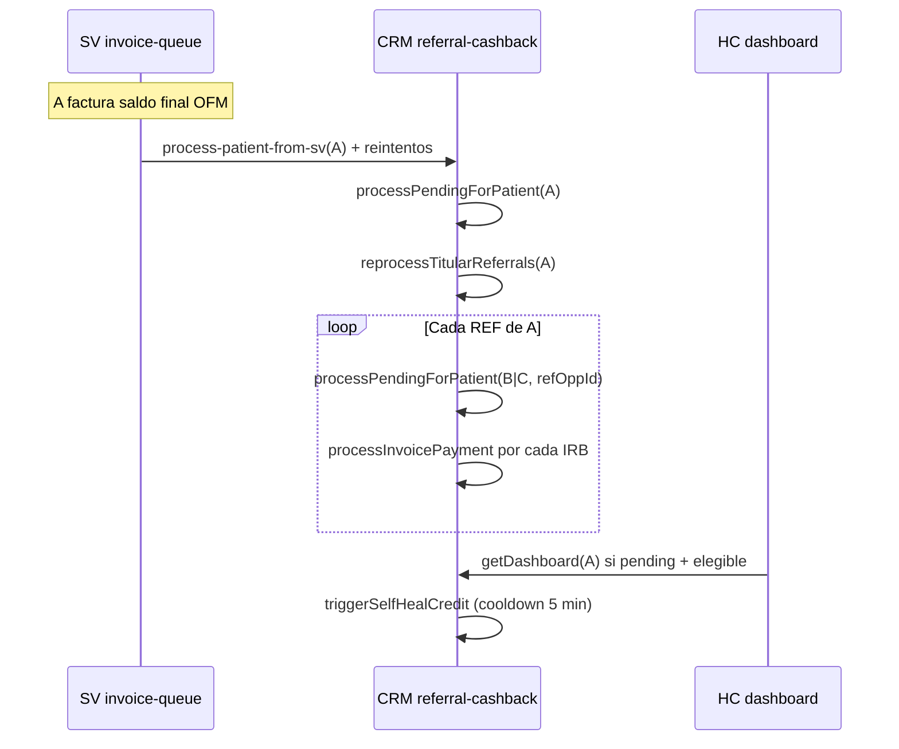

> Copiado del vault Obsidian `maxillaris-memory/03-referencia/` el 2026-08-27 para que la nota viva en el repositorio.
> Los enlaces `[[nota]]` del vault se dejaron como texto. Índice de este repo: `docs/README.md`.

# Cashback por referidos — Flujo completo (REF → acreditar → usar)

> **Documento maestro** para alinear negocio, UX y backend.  
> Consultar **antes** de tocar cashback, referidos REF-N, cerradoras paso 3, agenda OI o HC dashboard.  
> Sesión origen: 2026-06-30-b6012356 · Punto 11 acuerdos marketing.

---

## Resumen en una frase

El **referidor (A / Francis)** gana saldo cuando su **referido (B)**, ya registrado como **oportunidad REF-N en CRM Ventas**, **factura** pagos de contrato **OFM al contado** en cerradoras. A **usa** ese saldo opcionalmente en cerradoras, agenda OI paso 3 o (futuro) sv-front. Se **ve** en el dashboard de HC.

---

## Actores

| Rol | Ejemplo | Dónde vive en sistema |
|-----|---------|------------------------|
| **Referidor A** | Francis (Clarence) / Loki | HC SV + opp CRM principal (sin flag referido) |
| **Referido B** | Hermano/familiar mismo teléfono | HC SV propia + opp CRM `REF-N` |
| **Referidor intermedio** | Megumi (REF que ya pagó OFM 100%) | Opp REF elegible; puede referir a C |
| **Vínculo REF** | B referido de A; C de B | CRM: `c_is_referral_creation` + `c_primary_opportunity_id` (directo) + `c_referral_root_opportunity_id` (titular raíz) |
| **Enlace SV↔CRM** | Qué HC es cada opp | SV: `clinic_history_crm` (`espo_id` → `patient_id`) |

### Cadena de referidos (escalable)

| Columna CRM | Significado |
|-------------|-------------|
| `c_primary_opportunity_id` | **Referidor directo** (quien trajo a este paciente). Puede ser opp REF si tiene OFM 100% pagado. Cashback usa este vínculo. |
| `c_referral_root_opportunity_id` | **Titular raíz** del núcleo familiar (opp no-REF). Mismo `contact_id` para toda la familia; trazabilidad en ledger (`metadata.referralRootOpportunityId`). |

Ejemplo Loki → Megumi → amigo:

```
Loki (raíz)  ←── c_referral_root ──  Megumi REF-2  ←── c_primary ──  Amigo REF-3
```

- Megumi con contrato OFM 100% pagado: botón «Crear referido» en su cerradora crea `REF-3` con `c_primary` = Megumi.
- Cuando el amigo facture OFM, cashback va a **Megumi** (no a Loki), si sigue habilitada.

---

## ⚠️ Qué NO define “referido”

| Pantalla | Por qué NO es la definición de REF |
|----------|-------------------------------------|
| Agenda paso 1 (doctor / tipo cita) | Solo elige doctor, tarifa, calendario |
| “Tipo de agendamiento” (común vs admin) | Solo elige flujo de agenda (5 pasos vs admin) |
| CRM Controles (ver pendiente $3,300) | Estado del tratamiento; **no** crea REF ni genera cashback |
| Agenda paso 3 (pago evaluación) | Puede **usar** cashback de A; **no** genera cashback por ser “referido” |

**Referido se define en CRM Ventas** al crear la oportunidad REF-N (o equivalente).

---

## Diagrama maestro (recorrido completo)



---

## Los 5 pasos de agenda (appointmentCalendar)

Ver también integracion-creation-patient-appointmentCalendar.

| Paso | Nombre | Relación con cashback |
|------|--------|------------------------|
| 1 | Doctor / tipo cita | Ninguna (no REF) |
| 2 | Paciente | Ninguna |
| 3 | **Orden** (OS + pago) | **Aplicar** saldo (`applyContext: agenda-oi`) |
| 4 | Detalles orden | — |
| 5 | Resumen cita | — |

Flujo comercial previo (creation_patient):

1. Oportunidad CRM → “¿Ya es paciente?” → iframe 5 pasos  
2. O: ContractManager cerradoras → facturar → opcional abrir agenda  

---

## Cómo se crea el REF (3 caminos)

### A) Derivar a OI desde Historia Clínica

1. `GET /opportunities/oi-phone-check/:hcCode` (SV)  
2. Varias HC mismo teléfono → la **más antigua** = principal; la actual = **referido**  
3. `POST /opportunities/assign-oi-from-clinic-history` → CRM `createReferralFromSv`  
4. Payload: `isReferral`, `primaryOpportunityId`, `patientIdOverride`, `referredClinicHistoryCode`

Documentado en: `new-clinic-history/services/oiDerivationService.ts`

### B) Mismo teléfono en CRM Ventas (cerradoras)

- `opportunity.service.createWithSamePhoneNumber()`  
- Opp nueva: `REF-N`, `cIsReferralCreation: true`, `cPrimaryOpportunityId` = opp principal  

### C) Registro explícito SV → CRM

- `CreateOpportunityDto.isReferral = true` + ids del principal y paciente B  

---

## Reglas de negocio cerradas (jun 2026)

| Tema | Regla |
|------|--------|
| **Modalidad contrato** | OFM **al contado** (`OFM_CONTADO`) u **en cuotas** (`OFM_CUOTAS`) |
| **Qué pagos generan cashback (referido B)** | **Contado:** 10% de la **factura que cierra** el contrato (suma de líneas IRB del mismo head: Moldes + Único Pago en una boleta = base completa). **Cuotas:** 10% de **Moldes + Inicial** (ambos con balance 0) al facturar el primer pago + 10% de las **cuotas 1..N** al **cerrar** el contrato |
| **Cambio de modalidad** | Si B pagó Moldes+Inicial en **cuotas** y luego pasa a **contado**, ese tramo **sigue** generando / mostrando cashback (~10% de $1000). El motor mira facturas históricas (incluye `contract_detail` desactivado) no solo la estructura vigente. Al cerrar luego como contado, no se vuelve a pagar el mismo tramo (resta base ya acreditada). |
| **Qué NO genera** | Abonos parciales en contado antes de cerrar (salvo el caso histórico moldes+inicial); cuotas intermedias (solo primer pago Moldes+Inicial + cierre de cuotas) |
| **Monto base** | **10%** del tramo que dispara el evento: factura de cierre en contado (todas las líneas de esa boleta), moldes+inicial, o cuotas restantes |
| **¿100% del contrato?** | **Sí** si el cierre es una sola factura con todas las líneas. **No** si hubo pagos parciales en **facturas distintas** (solo la última factura de cierre) |
| **Pago “efectivo”** | = **facturado/concluido** (tarjeta, transferencia, etc.) |
| **Francis habilitado** | **Contado:** OFM pagado al **100%**. **Cuotas:** Moldes + Inicial pagados y facturados (no exige cerrar todas las cuotas). |
| **Orden A vs B** | Indistinto quién paga primero; al facturar B se valida que A ya esté habilitado |
| **Usar saldo** | **Opcional**; A acumula si no usa |
| **Moneda saldo** | PEN o USD según moneda del IRB; conversión al usar en otra moneda = TC del día del uso |
| **Anulación factura** | Por ahora **no** revoca cashback ya acreditado |
| **% dinámico** | Config global en CRM (`referral_cashback_config`); default 10% |
| **Legacy ≤2024** | Regla especial contrato activo + control OFM — **pendiente en código** |

---

## Motor backend — pasos al facturar B (no confundir con agenda paso 1)

Cuando SV termina de facturar una OS del referido B:

| # | Paso backend | Qué hace |
|---|--------------|----------|
| 1 | `getInvoiceCashbackContext(irbId)` | Lee factura SV: `patientId`, monto, moneda, OFM_CONTADO |
| 2 | `findReferredOpportunityByPatientId(patientId)` | Busca opp CRM REF cuyo `clinic_history_crm.patient_id` = B |
| 3 | Validar `cIsReferralCreation` | Si no hay opp REF → **skip** |
| 4 | `resolveReferrerOpportunity` | `c_primary_opportunity_id` → Francis |
| 5 | `isPatientReferrerEligible(Francis)` | Francis: contrato OFM **100% pagado** en SV |
| 6 | Acreditar | `EARNED` 10% según fase: contado completo / cuotas moldes+inicial / cuotas cierre |

**Disparadores:**

- Automático: `sv-backend` `invoice-queue.service` → `process-patient-from-sv`  
- Manual/backup: cerradoras `POST /referral-cashback/process-patient/:patientId`  
- Por IRB: `POST /referral-cashback/process-invoice` `{ sourceIrbId }`

---

## Usar saldo (`apply`)

| Dónde | Endpoint | `applyContext` |
|-------|----------|----------------|
| Cerradoras Step 3 | CRM JWT `POST /referral-cashback/apply` | `cerradoras` |
| Agenda OI paso 3 | SV proxy `POST /referral-cashback/apply` | `agenda-oi` |
| HC dashboard / flip tarjeta | Solo lectura (`dashboard`) | — |

`apply` **resta saldo en CRM**; la UI debe reflejar que el pago en efectivo/tarjeta es **menor** (descuento no va solo al ledger).

---

## Inventario de endpoints (jul 2026)

> **Un módulo de negocio** (`referral-cashback` en CRM). Varios endpoints = distintos *usos*, no varios motores.

### CRM — API JWT (`referral-cashback.controller.ts`)

| Método | Ruta | Uso |
|--------|------|-----|
| `GET` | `/referral-cashback/config` | Leer % / flags |
| `PATCH` | `/referral-cashback/config` | Actualizar config |
| `GET` | `/referral-cashback/balance/:patientId` | Solo saldo |
| `GET` | `/referral-cashback/ledger/:patientId` | Movimientos |
| `GET` | `/referral-cashback/dashboard/:patientId` | Saldo + ledger enriquecido + pendientes + elegibilidad (1 call HC) |
| `GET` | `/referral-cashback/eligibility/referrer/:patientId` | ¿Titular habilitado? |
| `POST` | `/referral-cashback/process-invoice` | Acreditar por IRB |
| `POST` | `/referral-cashback/process-patient/:patientId` | Acreditar pendientes del paciente (backup cerradoras) |
| `POST` | `/referral-cashback/apply` | Usar saldo |

### CRM — bridge desde SV (`referral-cashback-from-sv.controller.ts`)

| Método | Ruta | Uso |
|--------|------|-----|
| `GET` | `.../balance-from-sv/:patientId` | Proxy interno |
| `GET` | `.../dashboard-from-sv/:patientId` | Proxy interno |
| `GET` | `.../ledger-from-sv/:patientId` | Proxy interno |
| `POST` | `.../apply-from-sv` | Proxy interno |
| `POST` | `.../process-patient-from-sv/:patientId` | Hook post-factura SV |

### SV — proxy JWT (`sv-backend` `referral-cashback.controller.ts`)

| Método | Ruta | Quién llama |
|--------|------|-------------|
| `GET` | `/referral-cashback/balance/:patientId` | Agenda OI |
| `GET` | `/referral-cashback/ledger/:patientId` | — |
| `GET` | `/referral-cashback/dashboard/:patientId` | HC (`new-clinic-history`) |
| `POST` | `/referral-cashback/apply` | Agenda OI |

### Fronts — qué consumen

| App | Servicio | Endpoints efectivos |
|-----|----------|---------------------|
| `creation_patient` | CRM API | `balance`, `process-patient`, `apply` |
| `new-clinic-history` | SV → CRM | `dashboard` (HC + flip `PatientCardCashbackQuickView`) |
| `appointmentCalendar` | SV | `balance`, `apply` |

---

## Acreditación cascada titular

Cuando el **titular A** cierra su OFM al **100%**, se acredita **todo** el cashback pendiente de sus referidos (todas las fases/IRB no duplicados en ledger).

### Regla de habilitación

`isPatientReferrerEligible(patientId)` (SV): al menos un contrato `OFM_CONTADO` o `OFM_CUOTAS` con todas las líneas activas `balance ≤ 0.01` y al menos una factura válida (`status_invoice = 1`, sin NC).

Mientras A no cumple → `processInvoicePayment` responde `skipped`: *Referidor no habilitado (OFM contado/cuotas al 100% o moldes+inicial en cuotas)*.

**Cuotas (A):** con Moldes + Inicial pagados al 100% y facturados, `isPatientReferrerEligible` devuelve `true` aunque queden cuotas pendientes. El dashboard dispara `selfHealCredit` al abrir la cuenta.

### Disparadores (en orden típico)



| Disparador | Ruta / código |
|------------|----------------|
| Hook post-factura SV | `invoice-queue.service` → `processReferralCashbackForPatient` → `POST .../process-patient-from-sv/:id` |
| Cerradoras Step3 | `referralCashbackService.processPatientAfterInvoice` → `POST /referral-cashback/process-patient/:id` |
| Dashboard HC | `getDashboardByPatient` → `triggerSelfHealCredit` |
| Manual | `POST /referral-cashback/process-patient/:titularPatientId` |

### Lógica cascada

`reprocessTitularReferrals(titularPatientId)`:

1. Si `!isPatientReferrerEligible` → return `[]`
2. `listReferralOpportunitiesForTitular` — REF con `c_primary_opportunity_id` = opp del titular (por HC)
3. Por cada referido: `processPendingForPatient(referredPatientId, refOpp.id, { skipTitularCascade: true })`
4. Lista IRB: OFM (moldes+inicial, cierre) + OI plan + OI standalone; idempotencia por `sourceIrbId` y `contractId` + `cashbackPhase`

El **pending del dashboard** (`buildPendingReferralCashback`) y la **acreditación** (`processInvoicePayment`) usan la misma lógica de fases y anti-doble contado → el total mostrado (~$360 + ~$250) debe coincidir con lo que entra al ledger.

### Matiz timing

Si `process-patient` corre **antes** de que SV persista `balance = 0`, `reprocessTitularReferrals` puede no ejecutar en el 1.er intento. Mitigación: reintentos del hook SV + self-heal al abrir dashboard.

---

## Comportamientos de motor ya en código (jul 2026)

- Cascada `reprocessTitularReferrals` cuando el titular completa OFM 100% (ver sección anterior).
- Dashboard **no oculta** referidos pendientes si titular ya habilitado.
- `triggerSelfHealCredit` en dashboard (cooldown ~5 min).
- `resolveReferrerPatientId` con fallback por `c_clinic_history` si falta `patient_id` (datos viejos).
- Fix raíz titulares: `opportunityEspoId` en create-patient + link en `clinic_history_crm` → ver 2026-07-06-cashback-referidos-patient-id-titular.
- **Cambio modalidad cuotas→contado (2026-07-08):** Moldes+Inicial ya facturados siguen como trigger `OFM_CUOTAS_INICIAL` aunque `treatment_code` pase a `OFM_CONTADO` (SV desactiva la línea "Inicial").
- **Fases acumuladas por referido:** el dashboard **suma** pending moldes+inicial (~$100) + cierre contado restante (~$260) → muestra ~$360 (o $100+$260), no reemplaza uno por el otro. Antes solo guardaba “un best” por referido y se perdía el $260.

---

## Casos de prueba validados

| Fecha | Caso | IDs | Resultado |
|-------|------|-----|-----------|
| 2026-07-06 | A titular + B referido end-to-end | A **30890** / HC LMX126-008592 · B **30891** / LMX126-008593 | B cierra → `waiting_referrer_eligibility`; A cierra → ~**$230** acreditados |
| Prev | Cadena / varios referidos | A 30884 · B–D 30885–30887 | Cascada / pendientes |
| 2026-07-08 | B cuotas moldes+inicial → cambia a contado | A **30892** LMX126-008594 · B **30893** LMX126-008595 | ~~Antes~~ desaparecía ~$100; **fix** pending ~**$360** ($100+$260) con desglose por fase |
| 2026-07-08 | C contado parcial → cuotas → moldes+inicial | A 30892 · C ~30896 | Pending ~**$250** listo al habilitar titular |
| 2026-07-08 | Titular A cierra OFM 100% (código) | A + B + C arriba | **Confirmado en código:** cascada acredita **todos** los pending (~$610) vía `reprocessTitularReferrals`; validar en entorno con ledger/dashboard |
| — | Relación correcta | — | Motor usa `c_primary_opportunity_id`, **no** opp cerradora |

---

## UX HC (`new-clinic-history`)

- Flip tarjeta: vista rápida cashback (y tabs Plan \| Cashback si hay plan familiar).
- Preferencia avisos hover por usuario: `usePatientCardWarningPrefs` / localStorage `hc-patient-card-hover-warnings:{userId}`.
- Detalle sesion UI + merges: 2026-07-08-cashback-merges-ui-informe.

---

## Tablas y archivos clave

### CRM (backend-crm)

| Recurso | Rol |
|---------|-----|
| `referral_cashback_config` | % default, activo |
| `referral_cashback_balance` | Saldo por patient_id + moneda |
| `referral_cashback_ledger` | EARNED / USED / ADJUSTMENT / EXPIRED |
| `opportunity.c_primary_opportunity_id` | REF → referidor directo |
| `opportunity.c_referral_root_opportunity_id` | Titular raíz familia |
| `opportunity.c_is_referral_creation` | Flag referido |
| `src/referral-cashback/` | Módulo completo |
| Migraciones `1749530000000` / `1749530100000` | Tablas + expiration |

### SV (sv-backend-main)

| Recurso | Rol |
|---------|-----|
| Queries OFM + elegibilidad (vía CRM / servicios SV) | Contexto factura, contratos |
| `invoice-queue.service` | Hook post-factura → process-patient-from-sv |
| `referral-cashback/` módulo | Proxy JWT → CRM (HC, agenda) |
| `BackendCrmService` | Cliente HTTP interno |
| `clinic_history_crm.patient_id` | Puente HC ↔ opp (crítico para titular) |

### Front

| App | Qué |
|-----|-----|
| `creation_patient` Step3 + InvoicePage | apply + process-patient + descuento en max pago |
| `new-clinic-history` dashboard + flip tarjeta | Ver saldo / dashboard |
| `appointmentCalendar` step3 + multi-step-modal | apply tras factura OI |

---

## Pendiente / gaps código vs negocio

- [ ] Regla pacientes legacy ≤2024 en elegibilidad  
- [ ] Descuento automático en payload factura SV al `apply` (hoy es contable + UI manual)  
- [ ] sv-front-main (Angular legacy)  
- [ ] Reversión cashback si anulan factura  
- [ ] % dinámico por paciente (solo config global hoy)  
- [ ] Motor Kafka/BullMQ campañas (otro equipo; fuera de este flujo)

---

## Relacionado

- Choque cotizacion_id en cerradoras (tema aparte)
- integracion-creation-patient-appointmentCalendar
- 2026-06-30-b6012356
- 2026-07-06-cashback-referidos-patient-id-titular
- 2026-07-08-cashback-merges-ui-informe
- backend-crm
- sv-backend-main

#cashback #referidos #REF-N #OFM_CONTADO #crm-ventas #cerradoras #agenda-oi #hc
